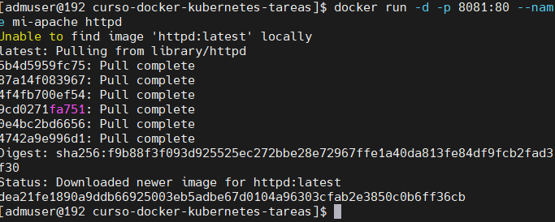
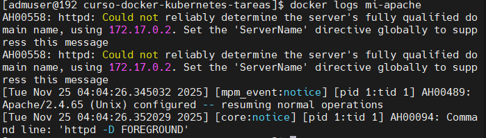
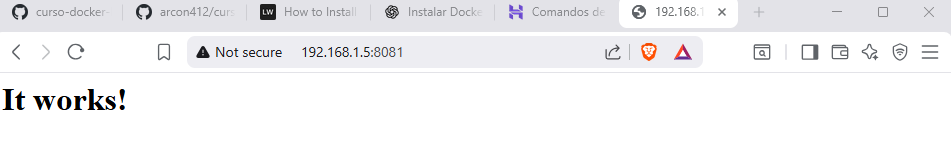
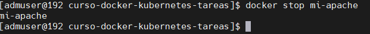
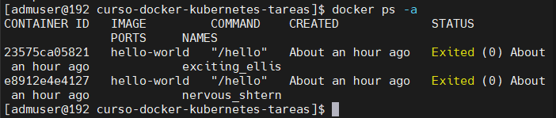

# Clase 1 - Introducción a Containers y Docker

# Aplicación elegida: Apache HTTP Server (httpd)

## Objetivo
En esta práctica se desplegó un servidor web Apache usando Docker, exponiendo el servicio en el puerto 8081 y ejecutándolo en segundo plano.

## Desarrollo

### 1. Ejecutar el container

```bash
docker run -d -p 8081:80 --name mi-apache httpd

```
**Explicación:**

**docker run**
	Ejecuta un nuevo contenedor.

**-d**
	Ejecuta el contenedor en segundo plano (modo detached).

**-p 8081:80*
	Mapea el puerto 80 del contenedor al puerto 8081 de la máquina local

**--name mi-apache**
	Asigna un nombre personalizado al contenedor.

**httpd**
	Imagen utilizada (servidor Apache).


**Screenshot:**



**Salida:**
```
dea21fe1890a9ddb66925003eb5adbe67d0104a96303cfab2e3850c0b6ff36cb
```
 

### 2. Verificación del Funcionamiento

# Listar contenedores en ejecución

```bash
docker ps
```

**Screenshot:*


# Ver logs del contenedor

```bash
docker logs mi-apache
```

**Screenshot:*




#Acceder desde el navegador

Accedí a `http://192.168.1.5:8081` y obtuve:



### 3. Limpieza

# Detener comtenedor

```bash
docker stop mi-apache
```



# Eliminar Contenedor

```bash
docker rm mi-apache
```


# Verificar que ya no existe

```bash
docker ps -a
```




## Conclusiones

Aprendí a desplegar aplicaciones rápidamente usando Docker.

Entendí cómo funcionan los mapeos de puertos y la ejecución en segundo plano.

Me familiaricé con comandos básicos como docker run, docker ps, docker logs, docker stop, docker rm.

La única dificultad fue la configuración inicial de Docker, que resolví revisando repos, limpiando configuraciones y arrancando el daemon correctamente.

